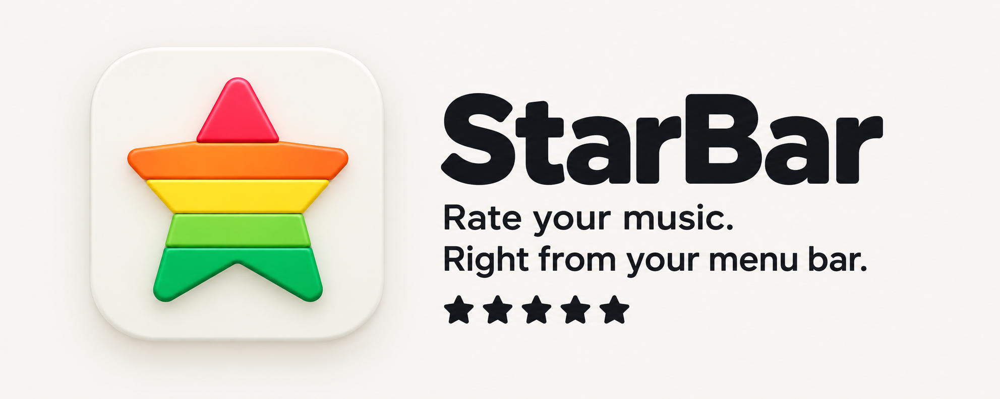

<p align="center">
  
</p>

# StarBar

**Give every song its stars.**

StarBar puts your Music ratings and favourites in the macOS menu bar. Click a star, drag to a rating or tap the heart, then carry on with what you were doing. No switching windows to find the song you are already listening to.

A library full of unrated songs is hard to make sense of. Rate them as you listen, remember the ones you love and give your Smart Playlists something useful to work with. Your ratings are saved in Music, where they belong.

[Get StarBar](https://github.com/rossshannon/StarBar/releases) · [How to use it](#using-the-menu-bar) · [Build from source](#build-and-install)

[](https://github.com/rossshannon/StarBar/actions/workflows/test.yml)

<p align="center">
  
  <br>
  <em>Ready to Start, Arcade Fire. Five stars, naturally.</em>
</p>

## Small app. Useful habits.

- **Rate while you listen.** Set whole or half stars from the menu bar, or use configurable keyboard shortcuts without leaving your work.
- **Keep your favourites close.** A separate heart makes it easy to mark a favourite without confusing it with a star rating.
- **Catch the songs you meant to rate.** An optional reminder gives unrated songs a gentle nudge before they end.
- **See what just came on.** An optional track announcement shows the artwork, song details, stars and heart, with Classic, Blur and Liquid Glass styles.
- **Make your library your own.** Rate songs already in your Music library, including Apple Music songs you have added. For a catalog song that is not there yet, StarBar offers to add it so you can rate it.

## Get started

StarBar needs **macOS 13 or later** and the **Music app**.

Download a build from [Releases](https://github.com/rossshannon/StarBar/releases), unzip it and move StarBar to Applications. Open it, allow it to control Music when macOS asks, and play a song. The stars appear in your menu bar.

If macOS blocks an unnotarised build, open **System Settings → Privacy & Security → Open Anyway**. See the release notes for the signing status of that build.

## Using the menu bar

- **Click a star** to set that rating.
- **Half stars**: turn on "Half star" in Preferences. Then click the left half of a star, or the gap just before it, to set a half star. For example, click the left half of the fourth star for 3½ stars.
- **Drag** across the stars and they fill in as you move. Let go to set the rating, the same as clicking at that spot. With half stars on, dragging across the gap between two stars shows where the half star begins. Let go over the heart to keep the last rating.
- **Heart**: click the heart after the stars to mark the song as a favourite in Music. A filled heart means the song is a favourite.
- **Right-click** to open the player popover.
- **Rating reminder**: when a song with no rating is nearly over, StarBar plays a bell and a hollow star sweeps across the dots and back. It happens once each time a song plays, 30 seconds before the end or three quarters of the way through, whichever is later. To turn it off, uncheck "Remind me to rate unrated songs" in Preferences.
- **Track announcement**: a translucent black strip slides up from the bottom of the screen when a new song starts, with the artwork on the left and the title, artist, album and the song's current stars and heart in white, then slides away after five seconds. Rate the song or tap the heart while the strip is up and it updates. "Strip style" in Preferences picks the background: Classic (Growl's flat black), Blur (a blur of whatever is behind the strip), or Liquid Glass (Apple's glass, with its lensed rim, on macOS 26 and later; the blur before that). It is a recreation of Growl's "Music Video" display. It is off by default: check "Show a Music Video strip when a new song starts" in Preferences to turn it on, and press Preview there to see it. "Show Current Track" in the popover's menu, or Option-Control-N, shows the strip for the current song whenever you like, even with announcements off.

## FAQ

### Are half-star ratings saved?

Yes. Music stores a rating as a number from 0 to 100, where each star is 20. So 3½ stars is saved as 70. The Music app on the Mac can't display half stars, so it shows the whole stars only (70 shows as 3 stars). The value is still stored, StarBar shows it, and smart playlist rules and AppleScript can use it.

To check a rating yourself:

```bash
osascript -e 'tell application "Music" to get {name, rating, favorited} of current track'
```

### Why is the favourite a heart when Music uses a star?

Music now uses a star for favourites and stars for ratings. In the menu bar, a heart keeps the favourite separate from the five rating stars. It is the same setting: Music's "Favorite" (called `favorited` in AppleScript, and `loved` in older versions).

### How can I show star ratings in Music?

Check the checkbox for "Star Ratings" in General preferences. [More info](https://support.apple.com/guide/music/general-preferences-mus4130f48/mac)

### Why does the player popover sometimes follow me to another Space?

The popover follows when it has focus. If another window has focus, it stays in its original Space.

### Which screen does the track announcement appear on?

The screen the mouse pointer is on when the song starts, along the bottom edge: above a Dock at the bottom, and running behind a Dock at the side. It grows with the screen, so it is about half as tall again on a 27-inch display as on a laptop. It stays on that screen until it slides away. It appears over full-screen apps too, and it never takes focus or clicks, so you can keep typing or click straight through it. With Reduce Motion on it fades instead of sliding; with Reduce Transparency on it is solid black.

### Why does StarBar not show the star rating when Music is playing?

In **System Settings → Privacy & Security → Automation**, turn on **Music** under **StarBar**. This lets StarBar read the current song and save your ratings and favourites.


## Build and install

Needs Xcode. The build script finds Xcode even when `xcode-select` points at the Command Line Tools.

```bash
./build.sh              # Release build into build/ (incremental; add --clean to start over)
./build.sh --install    # Also replace /Applications/StarBar.app and relaunch it
./build.sh --watch -i   # Rebuild and reinstall on source changes (needs fswatch)
./build.sh --test       # Run the tests that don't need Music
./build.sh --test-all   # Also run the tests that read from Music (play a track first)
./build.sh --ui-test    # Click and drag the real menu bar (see below)
```

Every build takes its version from the nearest `v*` tag behind it and its build number from the commit count, so a newer build always has a higher number and the About window's build number can be matched to a commit with `git log`.

The app is signed ad hoc ("Sign to Run Locally") with bundle ID `com.rossshannon.starbar`. After a rebuild, macOS can ask again for permission to control Music.

### Tests and CI

The app tests are hosted in the app, so a test run launches StarBar. `--test` never touches Music: `ScriptBridgeTests`, which reads the playing track, skips itself unless `--test-all` opts it in.

The unit tests cover clicks and drags with a fake mouse (`RatingClickControllerTests`), the star geometry and half-star round trips (`RatingControlGeometryTests`), the rating reminder and the track announcement strip, all with fakes in place of Music.

`--ui-test` runs `MenuBarRatingUITests` from the separate `StarBar UI Tests` scheme, which clicks and drags the real menu bar item. The app runs with `-UITesting YES`, so it shows the stars as if a song is playing and doesn't talk to Music. The tests take over the mouse and screen for about two minutes, so the script asks before it starts (`--yes` skips the question). The installed StarBar is quit while they run and reopened afterwards. macOS asks for authentication before UI tests can control the Mac. To stop it asking each time, run:

```bash
sudo automationmodetool enable-automationmode-without-authentication
```

GitHub Actions builds the app and runs `./build.sh --test` on macOS 15, 26 and 27, and `./build.sh --ui-test` on macOS 26 and 27, for every push to `main` and every pull request. The macOS 27 jobs use GitHub's preview image with an Xcode beta, so their failures are reported but don't fail the run. If the tests fail, the run uploads the test log and results as an artifact.

To run the tests before each commit that changes code, turn on the pre-commit hook once:

```bash
git config core.hooksPath .githooks
```

### Releases

Push a version tag to publish a release. For example, for version 1.1.0:

```bash
git tag v1.1.0
```

```bash
git push origin v1.1.0
```

The Release workflow runs the tests, builds the app with that version number (and the commit count as the build number, so each release's build number is higher than the last), and attaches `StarBar-v1.1.0.zip` and its SHA-256 to a new GitHub release.

Without signing secrets the app is signed ad hoc, not notarised, so macOS blocks it the first time it opens. To allow it, open System Settings, go to Privacy & Security, and click "Open Anyway".

To ship a signed and notarised build instead, add these [repository secrets](https://github.com/rossshannon/StarBar/settings/secrets/actions) (Settings → Secrets and variables → Actions) and the workflow does the rest:

| Secret | Value |
|---|---|
| `MACOS_CERTIFICATE_P12` | A "Developer ID Application" certificate with its private key, exported from Keychain Access as a `.p12` and base64-encoded (`base64 -i cert.p12 \| pbcopy`) |
| `MACOS_CERTIFICATE_PASSWORD` | The password given when exporting the `.p12` |
| `APPLE_TEAM_ID` | The ten-character team ID on the certificate |
| `APPLE_ID` | The Apple ID that submits to the notary service |
| `APPLE_APP_SPECIFIC_PASSWORD` | An app-specific password for that Apple ID, made at [account.apple.com](https://account.apple.com/) |

The first three sign the build; all five notarise it and staple the ticket, so it opens without a prompt. `build.sh` signs the same way locally when `STARBAR_CODESIGN_IDENTITY` and `STARBAR_TEAM_ID` are set.

Release checklist:

1. Merge to `main` and wait for the Tests workflow to pass.
2. Tag the release version and push the tag (above).
3. Watch the Release workflow; its notes say whether the build was notarised.
4. Download the zip from the release, check `shasum -a 256` against the `.sha256` file, and open the app once.

## Credits and licence

StarBar builds on [MainasuK/Song-Rating](https://github.com/MainasuK/Song-Rating), with favourites, rating reminders, track announcements and support for current macOS menu bar gestures.

StarBar is released under the [MIT License](./LICENSE).
