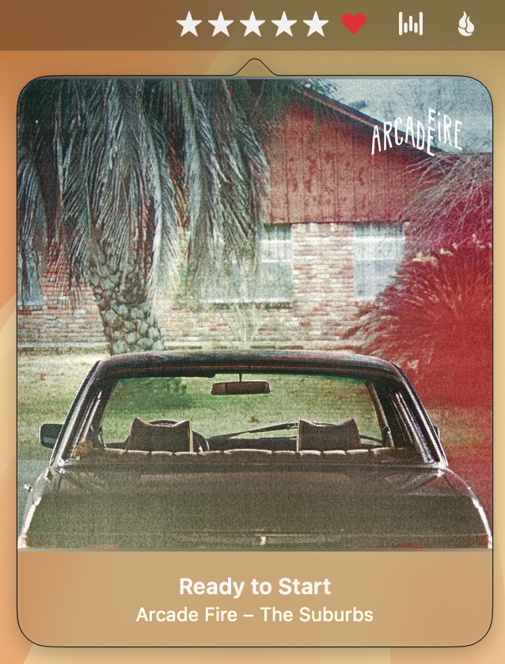
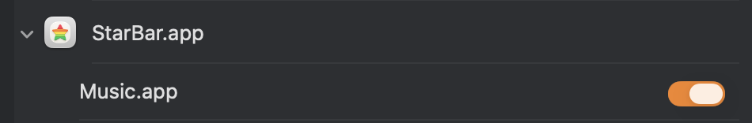

# StarBar
[](https://github.com/rossshannon/StarBar/actions/workflows/test.yml)

macOS menu bar app for rating music in iTunes/Music.app



StarBar is based on [MainasuK/Song-Rating](https://github.com/MainasuK/Song-Rating). It adds a favourite heart and fixes clicking on macOS 27.

## Requirements
- macOS 12 +

## Build and install
Needs Xcode. The build script finds Xcode even when `xcode-select` points at the Command Line Tools.

```bash
./build.sh              # Release build into build/
./build.sh --install    # Also replace /Applications/StarBar.app and relaunch it
./build.sh --watch -i   # Rebuild and reinstall on source changes (needs fswatch)
./build.sh --test       # Run the tests that don't need Music
./build.sh --test-all   # Also run the tests that read from Music (play a track first)
./build.sh --ui-test    # Click and drag the real menu bar (see below)
```

The app is signed ad hoc ("Sign to Run Locally") with bundle ID `com.rossshannon.starbar`. After a rebuild, macOS can ask again for permission to control Music.

### Tests and CI
The app tests are hosted in the app, so a test run launches StarBar. `--test` skips `ScriptBridgeTests` and `iTunesLibraryTests`, which need Music playing a track and access to the media library.

The unit tests cover clicks and drags with a fake mouse (`RatingClickControllerTests`) and the star geometry (`RatingControlGeometryTests`).

`--ui-test` runs `MenuBarRatingUITests` from the separate `StarBar UI Tests` scheme, which clicks and drags the real menu bar item. The app runs with `-UITesting YES`, so it shows the stars as if a song is playing and doesn't talk to Music. The tests take over the mouse and screen for about two minutes, so the script asks before it starts (`--yes` skips the question). The installed StarBar is quit while they run and reopened afterwards. macOS asks for authentication before UI tests can control the Mac. To stop it asking each time, run:

```bash
sudo automationmodetool enable-automationmode-without-authentication
```

GitHub Actions builds the app and runs `./build.sh --test` on macOS 15, 26 and 27, and `./build.sh --ui-test` on macOS 26 and 27, for every push to `main` and every pull request. The macOS 27 jobs use GitHub's preview image with an Xcode beta, so their failures are reported but don't fail the run. If the tests fail, the run uploads the test log and results as an artifact.

To run the tests before each commit that changes code, turn on the pre-commit hook once:

```bash
git config core.hooksPath .githooks
```

### Releases
Push a version tag to publish a release. For example, for version 1.1.0:

```bash
git tag v1.1.0
```

```bash
git push origin v1.1.0
```

The Release workflow runs the tests, builds the app with that version number, and attaches `StarBar-v1.1.0.zip` to a new GitHub release. The app is signed ad hoc, not notarised, so macOS blocks it the first time it opens. To allow it, open System Settings, go to Privacy & Security, and click "Open Anyway".

## Using the menu bar
- **Click a star** to set that rating.
- **Half stars**: turn on "Half star" in Preferences. Then click the left half of a star, or the gap just before it, to set a half star. For example, click the left half of the fourth star for 3½ stars.
- **Drag** across the stars and they fill in as you move. Let go to set the rating, the same as clicking at that spot. With half stars on, dragging across the gap between two stars shows where the half star begins. Let go over the heart to keep the last rating.
- **Heart**: click the heart after the stars to mark the song as a favourite in Music. A filled heart means the song is a favourite.
- **Right-click** to open the player popover.
- **Rating reminder**: when a song with no rating is nearly over, StarBar plays a bell and a hollow star sweeps across the dots and back. It happens once each time a song plays, 30 seconds before the end or three quarters of the way through, whichever is later. To turn it off, uncheck "Remind me to rate unrated songs" in Preferences.
- **Track announcement**: a translucent black strip slides up from the bottom of the screen when a new song starts, with the artwork on the left and the title, artist and album in white, then slides away after five seconds. It is a recreation of Growl's "Music Video" display. It is off by default: check "Show a Music Video strip when a new song starts" in Preferences to turn it on, and press Preview there to see it. "Show Current Track" in the popover's menu, or Option-Control-N, shows the strip for the current song whenever you like, even with announcements off.

## FAQ
### Are half-star ratings saved?
Yes. Music stores a rating as a number from 0 to 100, where each star is 20. So 3½ stars is saved as 70. The Music app on the Mac can't display half stars, so it shows the whole stars only (70 shows as 3 stars). The value is still stored, StarBar shows it, and smart playlist rules and AppleScript can use it.

To check a rating yourself:

```bash
osascript -e 'tell application "Music" to get {name, rating, favorited} of current track'
```

### Why is the favourite a heart when Music uses a star?
Music now uses a star for favourites and stars for ratings. In the menu bar, a heart keeps the favourite separate from the five rating stars. It is the same setting: Music's "Favorite" (called `favorited` in AppleScript, and `loved` in older versions).

### How can I check the track rating in iTunes/Music.app?  
Check the checkbox for "Star Ratings" in General preferences. [More info](https://support.apple.com/guide/music/general-preferences-mus4130f48/mac)

### Why the popover player sometimes follows to new screen scenes but sometimes not?
The popover will jump to new scren scene when it get focused. It will stand in the old screen if the current focused window not the popover.

### Which screen does the track announcement appear on?
The screen the mouse pointer is on when the song starts, along the bottom edge: above a Dock at the bottom, and running behind a Dock at the side. It grows with the screen, so it is about half as tall again on a 27-inch display as on a laptop. It stays on that screen until it slides away. It does not appear over a full-screen app, and it never takes focus or clicks, so you can keep typing or click straight through it. With Reduce Motion on it fades instead of sliding; with Reduce Transparency on it is solid black.

### Why does StarBar not show the star rating when Music is playing?
In System Settings, go to Privacy & Security, then Automation, and turn on Music for StarBar.


## License
StarBar is released under the [MIT License](./LICENSE).
